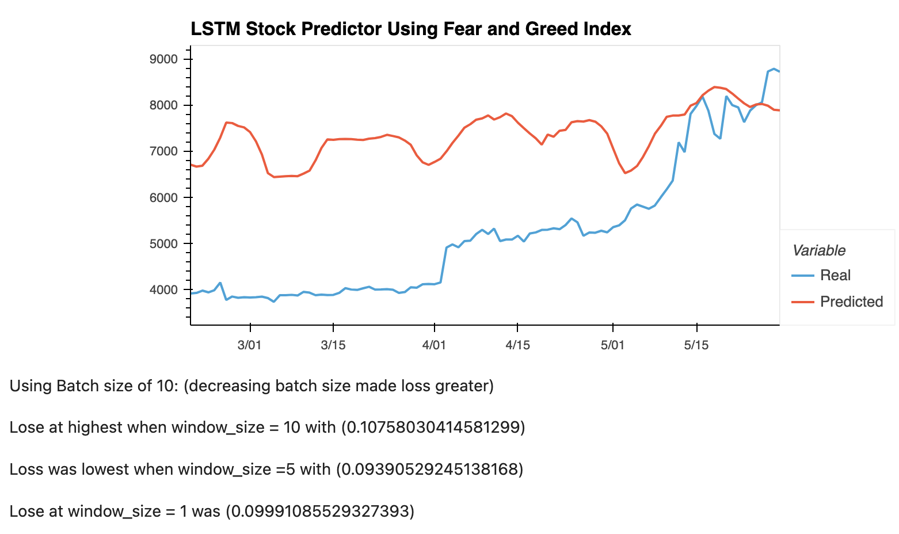
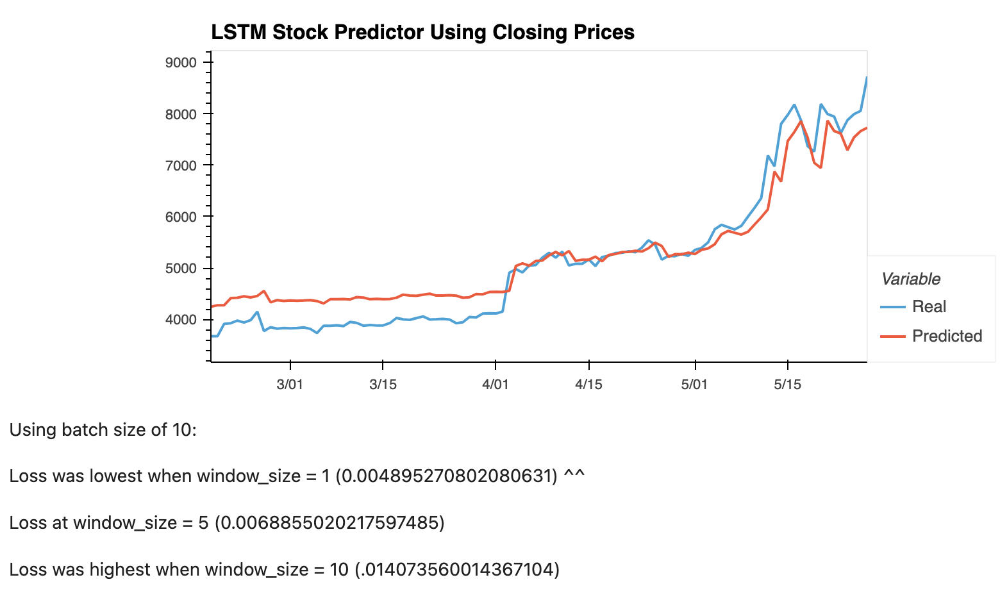

# LSTM Stock Predictor
*Deep Learning*

## Background 
I have been asked to help build and evaluate deep learning models using both the FNG values and simple closing prices to determine if the FNG indicator provides a better signal for cryptocurrencies than the normal closing price data.

In this assignment, I used deep learning recurrent neural networks to model bitcoin closing prices. One model will use the FNG indicators to predict the closing price while the second model will use a window of closing prices to predict the nth closing price.

---
## Method: 
 
For the Fear and Greed model, I ued the FNG values to try and predict the closing price. 

For the closing price model, I used previous closing prices to try and predict the next closing price. 

Each model will need to use 70% of the data for training and 30% of the data for testing.

I applied a MinMaxScaler to the X and y values to scale the data for the model.

Finally, I reshaped the X_train and X_test values to fit the model's requirement of samples, time steps, and features. 

 *most functions included in starter notebook* 

---
## LSTM Stock Predictor Using Fear and Greed Index 

## LSTM Stock Predictor Using Fear and Greed Index 

